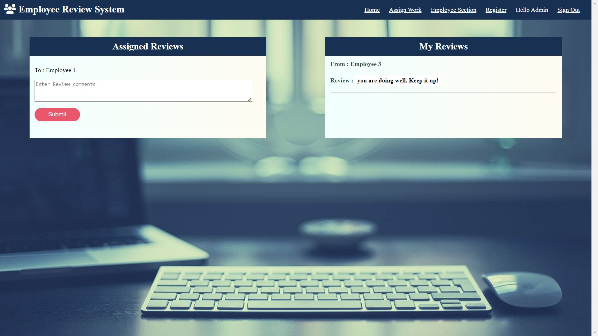
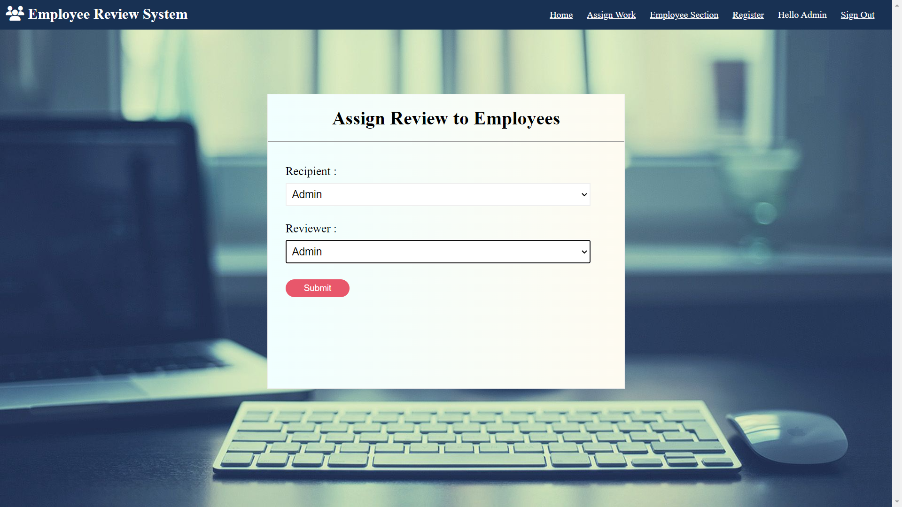
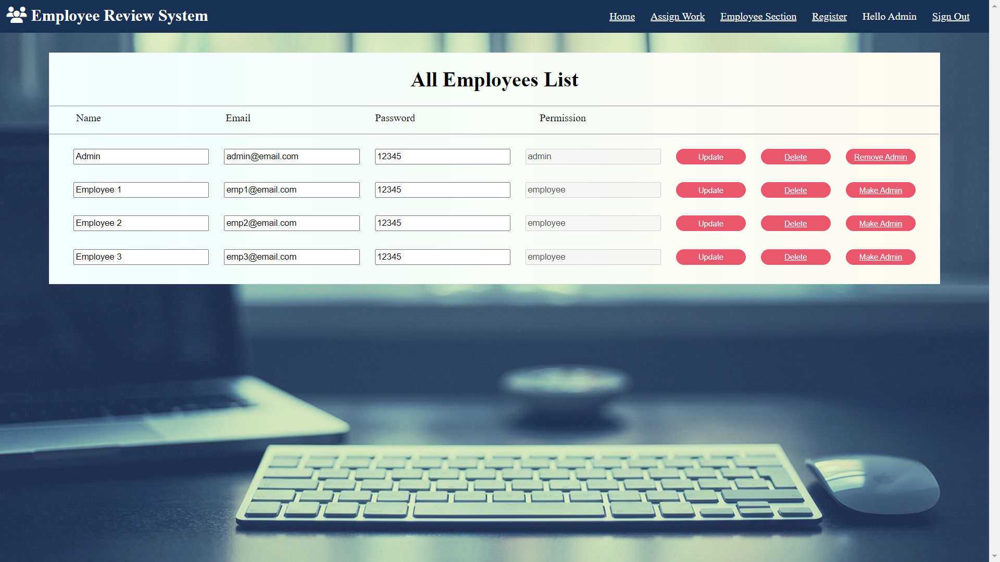
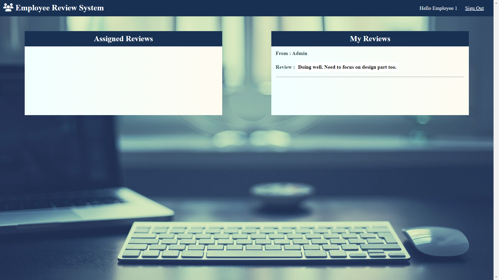

# Employee Review System Application 🚀

<br/>



Welcome to the Employee Review System application, designed for employees to submit feedback toward each other’s performance.

## ⭐ Introduction

The Employee Review System Application is a Full Stack Application built using MongoDB, ExpressJS, NodeJS, EJS, express-ejs-layouts,mongoose & passport implements MVC projects with cloud MongoDB.This project is basically used for the purpose of assigning employee to review other employees performance.
This website is only restricted for the use of employees.

## Features
### Features for admin only
-  Admin can login using the credentials.
-  Admin can add employee, view employee list, can remove employee, and update employee.
-  Admin can promote employee to admin role for allowing them to use all the admin features.
-  Admin can add performance review, update performance review, and can view performance review.
-  Admin can Assign employees to participate in another employee's performance review
-  Admin can remove an employee from admin role.

### Features for employee
-  Employee can login using the credentials.
-  Employee can see list of performance review requiring feedback.
-  Employee can submit feedback.
-  Login page is common for both the admin and emoloyee.
-  Employee can register.

# Technologies Used
[](https://skillicons.dev)

* HTML 
* CSS
* JavaScript
* Node.js
* Express
* npm
* MongoDB
* vscode
* mongoose

## File Structure
```csharp
Employee Review System/
├── assets/                  # Statis files
│   └── css/                 # Contains all the styling
│   └── images/              # Contains all the images used in application
├── config/                  # contains all the configuration files like mongoose.js, passport etc.
├── controllers/             # Controller logic 
├── models/                  # Database models
├── routes/                  # Route definitions
├── views/                   # EJS views
├── index.js                 # Express application setup
├── package.json             # NPM package configuration
├── README.md                # Project README File
├── .gitignore               # Git ignore configuration

```
## 🔥 Getting Started With The Project

-  Fork the Project in your Repository.
-  Clone the Forked Repository in your Local System.
-  Install & Configure - NodeJS & MongoDB.
-  Create '.env' file in config folder & Set the Environment Variables as following:  
-  PORT = Specifies the port number the application listens on.
-  MONGODB_URI = MongoDB database connection URL.
-  SECRET = for session.
-  Run 'npm install' in GitBash Terminal
-  Run 'npm start' in terminal to launch the project and get connect with the database.
-  Go to 'http://localhost:8000' to use application.
-  Enjoy :)

## Screenshots





## Contributing
Feel free to contribute to this project by creating issues or submitting pull requests. Your contributions are welcome!
## Demo
To experience admin view kindly use following credentials.
-  User's email: admin@email.com
-  password: 12345

link for trial is:
[click here to experience it!](https://placement-cell-application-gfgo.onrender.com)

## Authors

- [sahejadkadivar](https://github.com/sahejadkadivar)

## 🐦 Follow Me:

> [LinkedIn](https://www.linkedin.com/in/sahejad-kadivar-667bb9227/)


I hope you like the project. Thanks for reading :)


